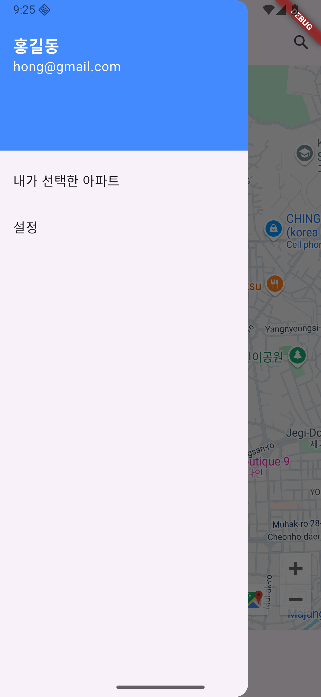

# mybudongsan
- 부동산 실거래가 조회 플러터 앱 만들기
- 개발언어 : Dart, Flutter
- 개발환경 : Android Studio, Firebase, Google Cloud Platform

## 0. 기획단계
- ① 부동산 앱의 목적과 기능 정의하기
- ② 부동산 앱의 화면 구성과 흐름도 작성하기
- ③ 부동산 앱의 디자인 가이드라인 선정하기
- ④ 부동산 앱에 필요한 데이터 모델과 API tjfrPgkrl

 

## 1. My 부동산앱 SWOT 분석
   | **S(강점)** | **W(약점)** |
   |:---:|:---:|
   | - 앱을 개발하며 전반적인 플러터 기능을 배울 수 있음. - 부동산 앱을 만들어 볼 수 있다. | - 상용화하려면 추가 기능이 필요함.  |
   | **O(기회)** | **P(위협)** |
   | - 플러터로 보기 좋은 디자인의 부동산 앱을 만든다.  | - 기능이 단순해 다순한 서비스가 되기 쉬움.  |

 

## 2. 화면 흐름도
### 2.1 부동산 거래가 조회 앱 흐름도

### 2.2 화면 흐름도

| 1.인트로 | 2.메인페이지 | 3.상세①-필터 | 4.상세②-검색결과 | 5.즐겨찾기 |
|:---:|:---:|:---:|:---:|:---:|
|  |  |  |  |  |
| - 이 페이지는 인터넷 연결 상태를 확인한다. - 온라인 상태라면 앱의 이름과 아이콘을 보여준 후, 2초 후에 메인 페이지로 자동 전환된다. | - 구글 지도 플랫폼을 이용하여 지도를 표시한다. | - 돋보기 아이콘을 클릭하면 검색필터를 표시해 검색 조건을 설정함. | - 사용자 정의 아이콘을 이용해 지도에 검색결과를 표시함. - 아이콘을 터치하면 자세한 내용을 확인할 수 있다. | - 자신의 즐겨찾기 아파트를 등록한다. - 해당 페이지에서는 로그인 상태라고 가정함. |

<!--
|     화면 페이지    |        설명       |
|:---------------:|:----------------:|
|  | - 이 페이지는 인터넷 연결 상태를 확인한다. -온라인 상태라면 앱의 이름과 아이콘을 보여준 후, 2초 후에 메인 페이지로 자동 전환된다. |
|  | - 구글 지도 플랙폼을 이용하여 지도를 표시함. |
|  | - 돋보기 아이콘을 클릭하면 검색필터를 표시해 검색 조건을 설정함. |
|  | - 사용자 정의 아이콘을 이용해 지도에 검색결과를 표시함. -아이콘을 터치하면 자세한 내용을 확인할 수 있다. |
|  | - 자신의 즐겨찾기 아파트를 등록한다. -해당 페이지에서는 로그인 상태라고 가정함. |
-->

 

## 3. 실제 앱 구현 화면
|1.인트로|2.홈화면|3.상세화면|4.리스트화면|
|---|---|---|---|
|  |  |  |  |

|5.즐겨찾기추가|6.메뉴화면|7.줄겨찾기화면|8.설정화면|
|---|---|---|---|
|  |  |  |  |

## 4. 개발 중 이슈
- connectivity_plus: ^4.0.2
  - 해당 라이브러리를 최신 버전으로 사용 시, '인터넷 연결 안됨' 오류가 발생. 꼭 해당 버전으로 사용해야 함.

<!--
## Getting Started

This project is a starting point for a Flutter application.

A few resources to get you started if this is your first Flutter project:

- [Lab: Write your first Flutter app](https://docs.flutter.dev/get-started/codelab)
- [Cookbook: Useful Flutter samples](https://docs.flutter.dev/cookbook)

For help getting started with Flutter development, view the
[online documentation](https://docs.flutter.dev/), which offers tutorials,
samples, guidance on mobile development, and a full API reference.
-->
